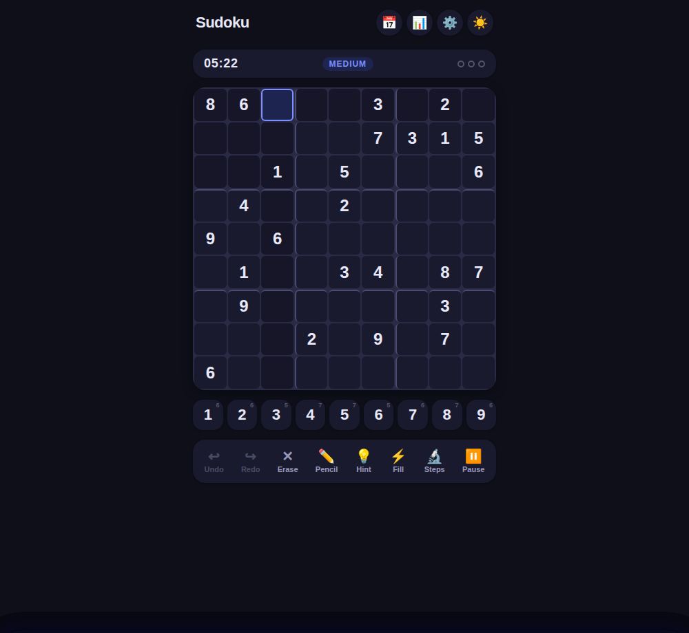
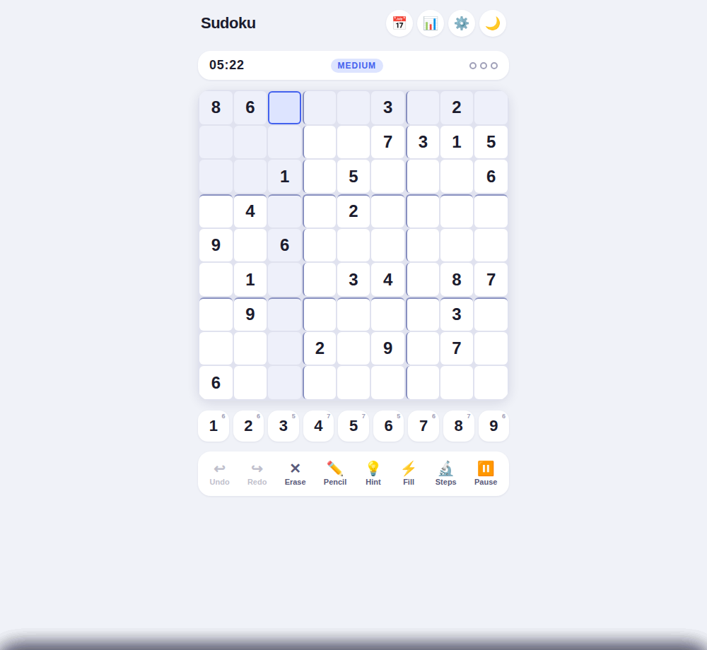
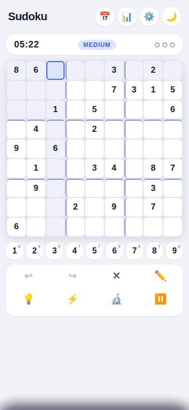

# Sudoku-99

Sudoku-99 is a local-first Sudoku game for the web. Generate puzzles, track your play, explore solving techniques, and keep playing offline after the app has loaded once.



| Light theme | Mobile layout |
|---|---|
|  |  |

## Features

- Generated puzzles with Easy, Medium, Hard, and Expert difficulties
- Daily Challenges with a UTC reset, progress, completion history, and shareable results
- Pause and Resume for timed games; backgrounding pauses the clock and requires an explicit resume
- Hints with technique explanations, candidate highlights, and a step-by-step solver
- Statistics for wins, losses, times, hints, mistakes, and streaks
- Local Puzzle Library with filters and favorites
- Puzzle import, export, and URL sharing
- Undo/redo, pencil marks, conflict detection, and solution reveal
- Light and dark themes, offline PWA support, and locally saved progress
- Accessibility foundations including keyboard controls, ARIA labels and announcements, visible focus, and reduced-motion support

Keyboard navigation, modal focus containment, touch targets, pencil-mark contrast, and save-failure messaging are implemented. Manual assistive-technology, installed-PWA, offline, persistence, and mobile acceptance remains before release; use the [Phase 11.6 validation checklist](docs/PHASE-11.6-MANUAL-VALIDATION-CHECKLIST.md) and [project handoff](docs/PROJECT-HANDOFF.md).

## Run Locally

Requirements: Node.js 18 or newer and Python 3.

```sh
npm ci
npm run build
python3 -m http.server 8000 --directory web
```

Open <http://localhost:8000>. The service worker requires a secure context; `localhost` is supported. After the first load, the app shell and game assets are available offline.

## Development

```sh
npm run build       # Production bundle and service worker
npm run typecheck   # TypeScript checks
npm test            # Automated tests
npm run verify      # Build, typecheck, and tests
```

The production bundle is written to `web/dist/main.js`. The web application is implemented in `src/`; the Qt/C++ application is archived.

## Documentation

- [Project handoff and current status](docs/PROJECT-HANDOFF.md)
- [Feature gap assessment](docs/FEATURE-GAP-ASSESSMENT.md)
- [Architecture](docs/ARCHITECTURE.md)
- [Development roadmap](docs/ROADMAP.md)
- [Solving techniques](docs/TECHNIQUES.md)
